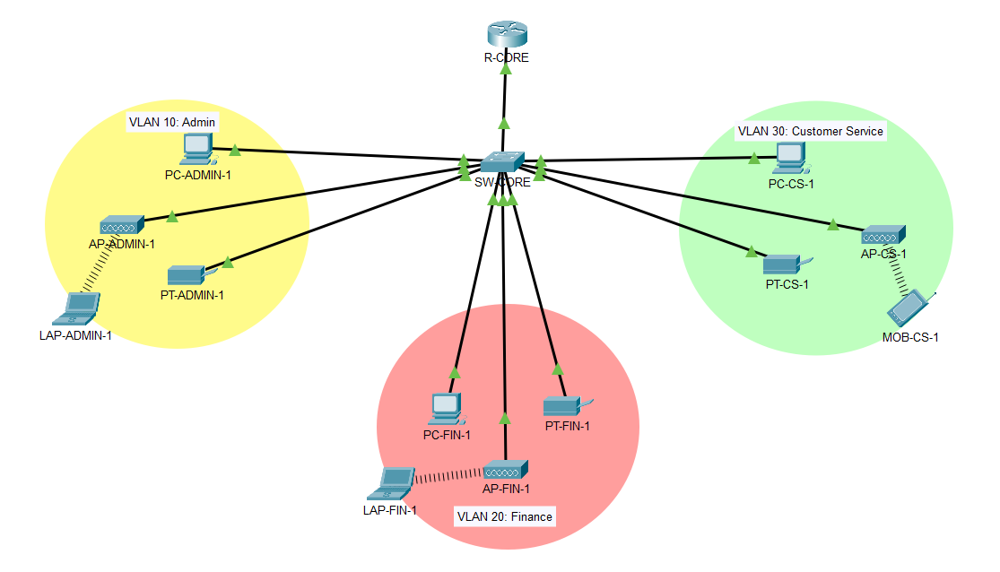

# Office VLAN Network

  
<p align="center">
  <strong>Network Representation</strong>
</p>

## Project Overview
This project demonstrates **VLAN Segmentation, Inter-VLAN Routing, DHCP, Trunking,** and **Wireless Connectivity** 
\
Base IP: 192.168.1.0/24

It is subnetted into /26 networks to support each department separately

| Department        | VLAN ID |
|-------------------|---------|
| Admin             | 10      |
| Finance           | 20      | 
| Customer Service  | 30      |

\
Packet Tracer File: [`/packet-tracer/office-vlan-network.pkt`](packet-tracer/office-vlan-network.pkt)
\
Documentation File: [`documentation/Office_VLAN_Network–Technical_Documentation.pdf`](/documentation/Office_VLAN_Network–Technical_Documentation.pdf)

---

### 1️⃣ Access Ports, Trunks Ports & VLANs
**Access Ports and Trunk Ports:** Access Ports connect devices to VLAN; Trunk Port carries multiple VLAN data between switch and router
\
\
**VLANs:** Separate departments and reduce broadcast traffic  

<details>
<summary><strong>Configuration Commands (click to expand)</strong></summary>

```
**Device:** SW-CORE

interface FastEthernet0/1
 switchport mode trunk
!
interface FastEthernet0/2
 switchport access vlan 10
 switchport mode access
!
interface FastEthernet0/3
 switchport access vlan 10
 switchport mode access
!
interface FastEthernet0/4
 switchport access vlan 10
 switchport mode access
!
interface FastEthernet0/5
 switchport access vlan 20
 switchport mode access
!
interface FastEthernet0/6
 switchport access vlan 20
 switchport mode access
!
interface FastEthernet0/7
 switchport access vlan 20
 switchport mode access
!
interface FastEthernet0/8
 switchport access vlan 30
 switchport mode access
!
interface FastEthernet0/9
 switchport access vlan 30
 switchport mode access
!
interface FastEthernet0/10
 switchport access vlan 30
 switchport mode access
```
</details>

---

### 2️⃣ Router-on-a-Stick
**Purpose:** Enable inter-VLAN routing for communication between departments  
<details>
<summary><strong>RoaS Commands (click to expand)</strong></summary>

```
**Device:** R-CORE

interface FastEthernet0/0.10
 encapsulation dot1Q 10
 ip address 192.168.1.1 255.255.255.192
!
interface FastEthernet0/0.20
 encapsulation dot1Q 20
 ip address 192.168.1.65 255.255.255.192
!
interface FastEthernet0/0.30
 encapsulation dot1Q 30
 ip address 192.168.1.129 255.255.255.192
```
</details>

---

### 3️⃣ DHCP
**Purpose:** Automatically assign IP addresses to PCs  
<details>
<summary><strong>DHCP Commands (click to expand)</strong></summary>

```
**Device:** R-CORE

ip dhcp pool AdminPool
 network 192.168.1.0 255.255.255.192
 default-router 192.168.1.1
 dns-server 192.168.1.1
 domain-name Admin.com

ip dhcp pool FinancePool
 network 192.168.1.64 255.255.255.192
 default-router 192.168.1.65
 dns-server 192.168.1.65
 domain-name Finance.com

ip dhcp pool CustomerPool
 network 192.168.1.128 255.255.255.192
 default-router 192.168.1.129
 dns-server 192.168.1.129
 domain-name Customer.com
```
</details>

---

### 4️⃣ Wireless Access Points
**Purpose:** Provide wireless connectivity for office devices  
<details>
<summary><strong>Access Point Configurations (click to expand)</strong></summary>

```
Device: AP-ADMIN-1
SSID: ADMIN-WIRELESS
Security: WPA2-PSK
Passphrase: ********
IP Assignment: DHCP
Connected VLAN: 10

Device: AP-FIN-1
SSID: FIN-WIRELESS
Security: WPA2-PSK
Passphrase: **********
IP Assignment: DHCP
Connected VLAN: 20

Device: AP-CS-1
SSID: CS-WIRELESS
Security: WPA2-PSK
Passphrase: ***********
IP Assignment: DHCP
Connected VLAN: 30

```
</details>

---

## Verification & Testing
- Intra-VLAN connectivity verified (Admin PC → Admin Printer)
- Inter-VLAN routing verified (Admin PC → Finance PC)
- DHCP assignment verified on wired client
- Wireless connectivity verified using Admin laptop