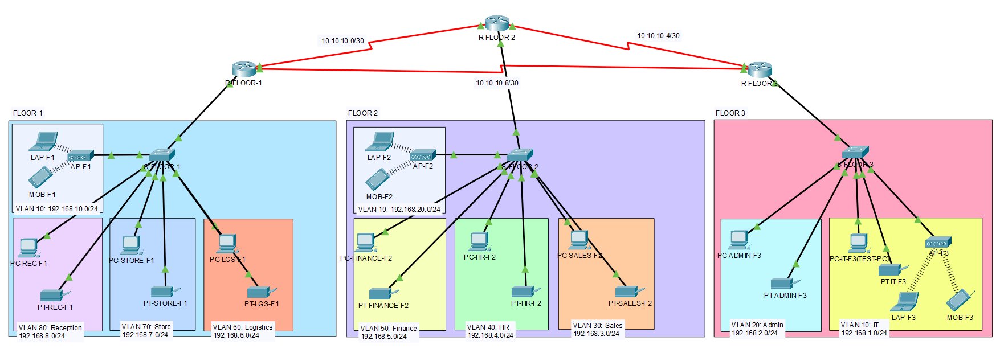
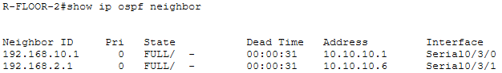
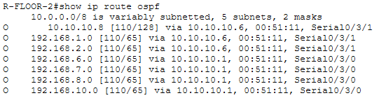
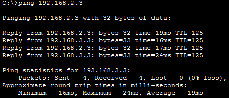
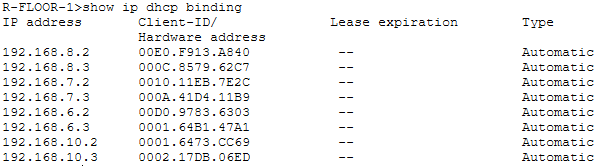
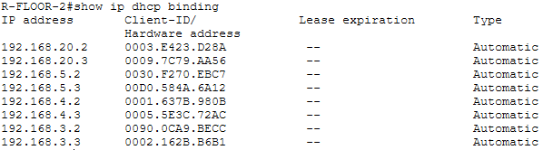
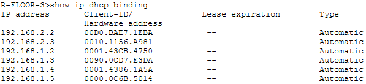
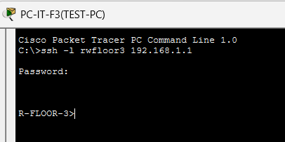

# Hotel Network Design – Enterprise Campus Network

<strong>Network Representation</strong>

## Project Overview
This project simulates a **multi-floor hotel enterprise network** designed using Cisco Packet Tracer  
The goal was to understand and implement industry-standard networking technologies

## Technologies Implemented

- VLANs & 802.1Q Trunking
- Inter-VLAN Routing (Router-on-a-Stick)
- OSPF Dynamic Routing (Area 0)
- DHCP (Router-based)
- Wireless Access Points (WPA2-PSK)
- Secure Remote Management (SSH)
- Port Security (Sticky MAC, Shutdown Mode)

---

## Verification & Testing (Summary)

**Detailed verification was performed on core enterprise technologies**, including:

<strong>OSPF Dynamic Routing </strong>(click to expand)

**Test Performed:**
- Verified OSPF adjacency routers
- Confirmed OSPF-learned routes in routing table

**Test Result:** Routers successfully formed adjacencies in Area 0 and learned routes

<strong>Inter-VLAN routing </strong>(click to expand)

**Test Performed:** An inter-vlan communication test was performed from PC-REC-F1 to PC-ADMIN-F3

**Test Result:** Successful ICMP packets were received

<strong>DHCP address assignment </strong>(click to expand)

**Test Performed:** DHCP Bindings on each router
**Test Result:** IP Addresses very assigned

<strong>Secure remote management (SSH) </strong> (click to expand)

**Test Performed:** SSHing from TEST-PC to R-FLOOR-3

**Test Result:** Succefully accessed!

## Project Files

- Packet Tracer File: [`/packet-tracer/hotel-network-design.pkt`](packet-tracer/hotel-network-design.pkt)

- Network Documentation & Testing: [`/documentation`](documentation/)

- Device Configurations: [`/configs`](configs/)