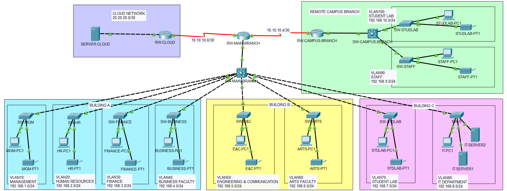
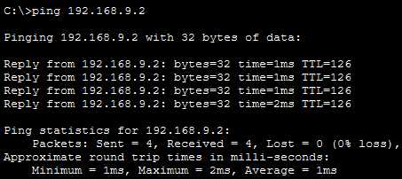
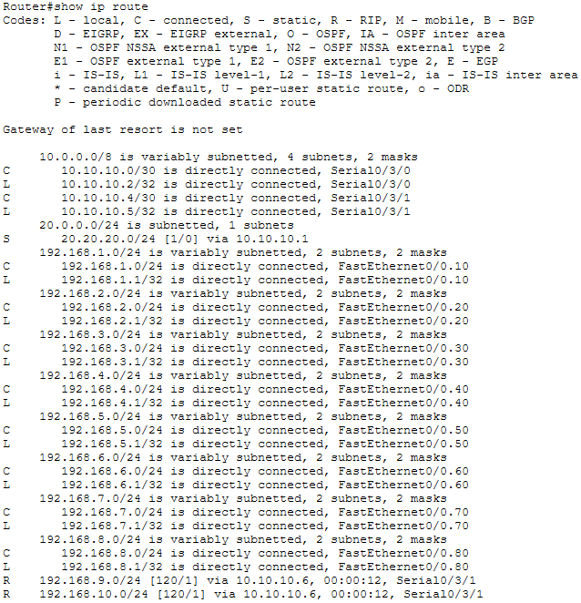
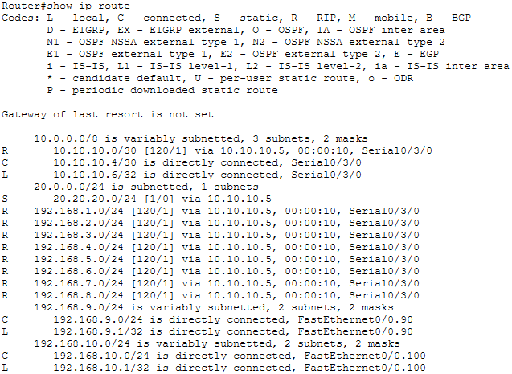
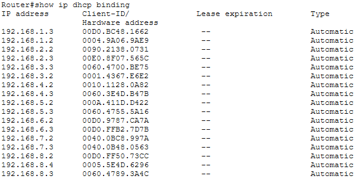
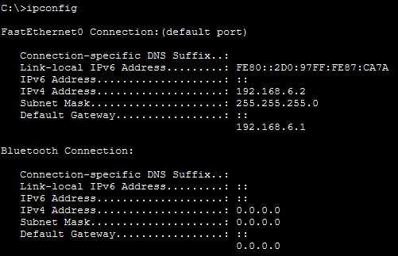
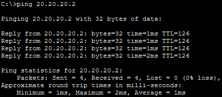

# University Campus Network Design


<p align="center"><strong>Network Representation</strong></p>

## Project Overview
This project simulates a **multi-campus university network** using Cisco Packet Tracer

**About the campus design:**
There are 2 branches of the campus, a main branch and a campus branch. The main branch has three buildings with different departments and the campus branch has two different departments. Both the network designs are implemented in a hierarchal manner with **Core Layer Devices** (RW-MAIN-BRANCH & RW-CAMPUS-BRANCH), **Distrubution Layer Devices** (SW-MAIN-BRANCH) and **Access Layer Devices** (switches belonging to each department). There is also a cloud server connected to these branches where static routing is performed
The goal was to implement **VLANs, inter-VLAN routing, dynamic & static routing**, and **DHCP services** in a realistic campus scenario.

## Technologies Implemented
- VLANs & 802.1Q Trunking
- Inter-VLAN Routing (Router-on-a-Stick)
- RIPv2 Dynamic Routing (Internal Networks)
- DHCP (Router-based for Main Campus)
- Cloud connectivity via Static Routing
- Access Layer Security (Port Access Control)

---

## Verification & Testing 

<details>
<summary><strong>Inter-VLAN Routing</strong> (click to expand)</summary>

**Test Performed:** ICMP test between PCs of different VLANs on main campus  
**Test Result:** Successful communication between VLANs

Ping from MGM-PC-1 to STAFF-PC-1



</details>

<details>
<summary><strong>RIPv2 Routing and Static Routes</strong> (click to expand)</summary>

**Test Performed:** Verified RIPv2 learned routes on both main and campus routers  
**Test Result:** All internal networks successfully reachable

Routes on RW-MAIN-ROUTER


Routes on RW-CAMPUS-ROUTER

</details>

<details>
<summary><strong>DHCP Assignment</strong> (click to expand)</summary>

**Test Performed:** Checked dynamic IP allocation for devices in Building A, B and C
**Test Result:** IP addresses successfully assigned from router-based DHCP

DHCP binding test results on RW-MAIN-BRANCH


```ipconfig``` results on ARTS-PC-1


</details>

<details>
<summary><strong>Cloud Server Connectivity</strong> (click to expand)</summary>

**Test Performed:** Ping from main campus PC to cloud server  
**Test Result:** Successful ICMP response received

Ping from BUSINESS-PC-1 to SERVER-CLOUD


</details>

## Project Files
- Packet Tracer File: [`/packet-tracer/campus-network-design.pkt.pkt`](packet-tracer/campus-network-design.pkt.pkt)  
- Network Documentation: [`/documentation/Campus-Network-Design_Technical-Documentation.pdf`](documentation/Campus-Network-Design_Technical-Documentation.pdf)