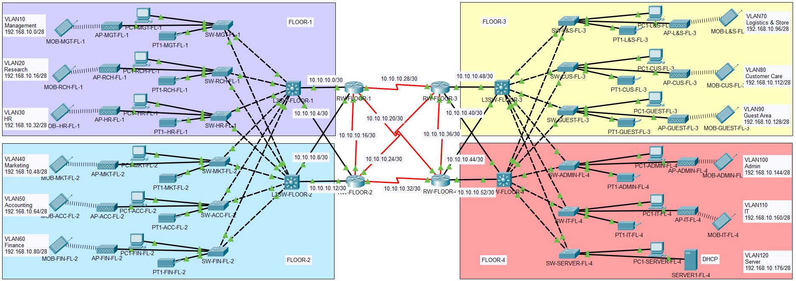
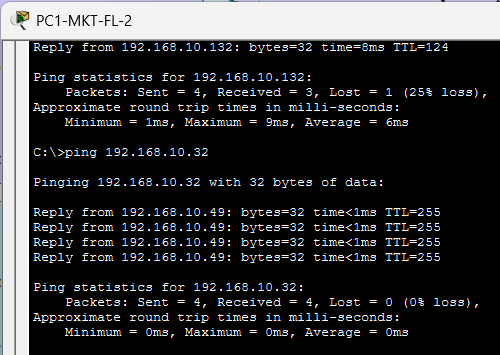
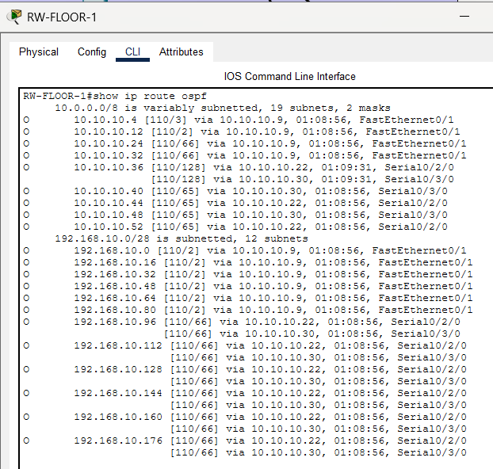
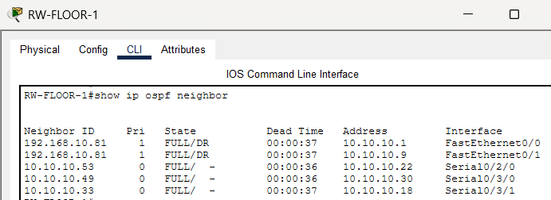
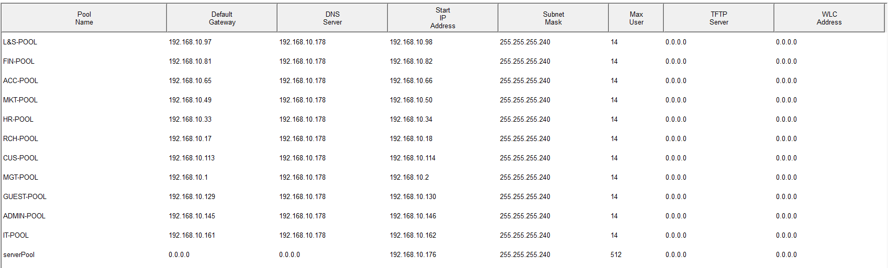
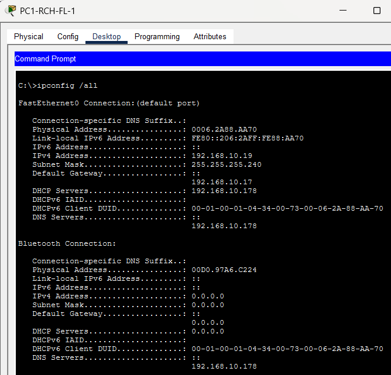
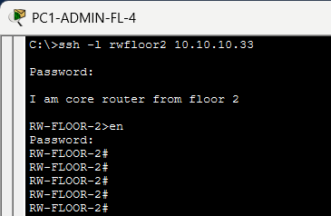

# Enterprise Network Design – Banking & Insurance Company

<strong>Network Representation</strong>

## Project Overview
This project demonstrates the design and simulation of an **enterprise-scale network** for a **Banking and Insurance organization** operating from a **four-story building**. The network is designed to meet real-world enterprise requirements such as **scalability, redundancy, security, and efficient traffic management**.

Industry-standard networking principles are applied, including **hierarchical network design**, **dynamic routing**, **VLAN-based segmentation**, **centralized IP address management**, and **secure remote device access**.

The network is both **visually modeled** and **fully simulated** using draw.io and cisco packet tracer

## Files

- Packet Tracer File: [`/packet-tracer/bank-network-design.pkt.pkt`](packet-tracer/campus-network-design.pkt.pkt) 
- Network Modelling Draw.io : [`/documents/network-modelling.jpg`](/documents/network-modelling.jpg)
- Addressing Plan: [`/documents/addressing-plan.md`](/documents/addressing-plan.md)
- Network Documentation: [`/documents/Bank-Network-Design_Technical-Documentation.pdf`](documents/Bank-Network-Design_Technical-Documentation.pdf)
---

## Hierarchial Design Model

### Core Layer
- Core routers providing inter-floor connectivity
- Redundant paths to ensure high availability

### Distribution Layer
- Layer 3 switches performing **inter-VLAN routing**
- Acting as default gateways for departmental VLANs
- Routing between access and core layers

### Access Layer
- Access switches connecting end-user devices
- VLAN enforcement and port-level security

NOTE : Redundancy is implemented between **FLOOR 1-2 & FLOOR 3-4**

---

## Technologies Used

- **OSPF (Open Shortest Path First)** for dynamic routing
- **IPv4 subnetting** based on departmental host requirements
- **/30 point-to-point links** for router and distribution connectivity
- **Centralized DHCP server** for dynamic IP assignment
- **DHCP relay** configured on Layer 3 switches
- **VLAN segmentation** (one VLAN per department)
- Inter-VLAN routing on Layer 3 switches
- **SSH** configured on all routers for secure remote management
- **Port Security**
  - Sticky MAC address learning
  - Shutdown mode on violation

## Verification & Testing

<strong>Inter-VLAN & Department Connectivity</strong> (click to expand)

**Test Performed:** ICMP test between PCs of different VLANs and across different departments  
**Test Result:** All VLANs and departmental devices can communicate successfully, confirming proper VLAN configuration and default gateway setup.

Ping from PC1-MKT-FL-2 (VLAN 40) to PC1-GUEST-FL-3 (VLAN 90)  

<strong>OSPF Routing Verification</strong> (click to expand)

**Test Performed:** Verified OSPF route advertisement and neighbor relationships on core routers  
**Test Result:** All subnets are correctly advertised and reachable across the network. Neighbor adjacency is in FULL state, confirming successful dynamic routing setup

Routes on core router RW-FLOOR-1  

OSPF neighbors  

<strong>DHCP Assignment</strong> (click to expand)

**Test Performed:** Checked dynamic IP allocation for all departmental PCs from the central DHCP server  
**Test Result:** PCs in each department receive correct IP addresses from their respective VLAN subnet ranges.

DHCP lease table on DHCP server  

IP configuration on PC1-RCH-FL-1  

<strong>SSH Remote Access</strong> (click to expand)

**Test Performed:** SSH login to core router RW-FLOOR-1 from admin computer PC1-ADMIN-FL-4  
**Test Result:** Successful SSH authentication and device access, confirming secure remote management configuration.

SSH login to core router on floor 1  

